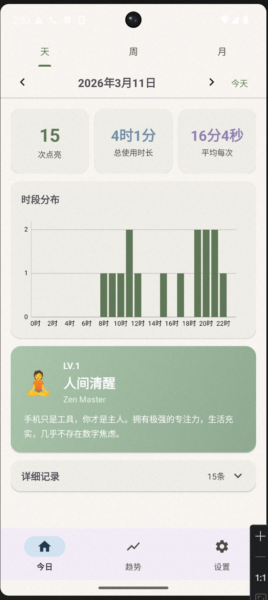
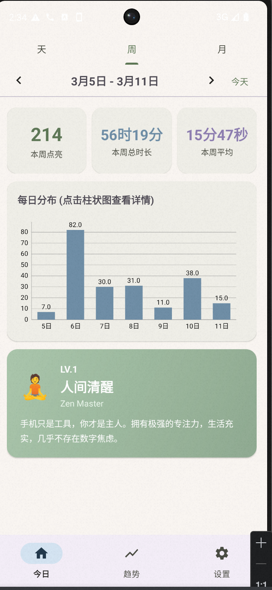
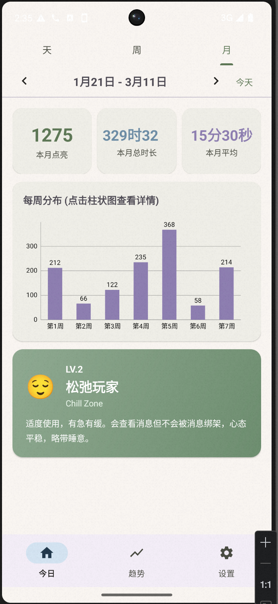
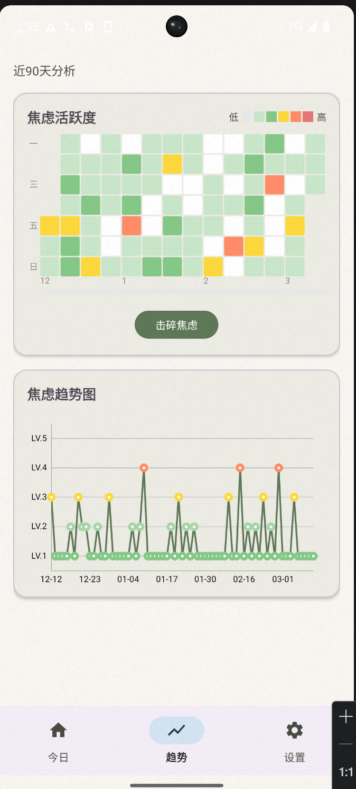
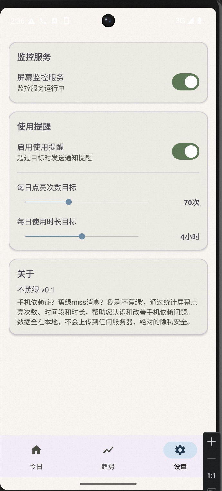

# 不蕉绿 - 屏幕使用统计与焦虑管理

<p align="center">
  
</p>

<p align="center">
  <b>认识手机依赖，改善数字焦虑</b>
</p>

<p align="center">
  <a href="#功能介绍">功能介绍</a> •
  <a href="#安装方法">安装方法</a> •
  <a href="#使用指南">使用指南</a> •
  <a href="./app-release_v0.1.apk">下载 APK</a>
</p>

---

## 📱 应用简介

**不蕉绿**是一款专注于手机屏幕使用统计与焦虑管理的 Android 应用。通过记录屏幕点亮次数、使用时长和时间段分布，帮助用户认识自己的手机使用习惯，从而改善数字焦虑和手机依赖问题。

> 🛡️ **隐私保护**：所有数据存储在本地，不会上传到任何服务器

---

## ✨ 功能介绍

### 1. 屏幕使用统计

| 功能 | 说明 |
|------|------|
| **点亮次数** | 记录每日屏幕点亮次数 |
| **使用时长** | 统计总使用时长和平均每次使用时长 |
| **时段分布** | 以柱状图展示24小时内的使用分布 |
| **详细记录** | 查看每次屏幕开启和关闭的具体时间 |

### 2. 焦虑等级评估

根据每日屏幕点亮次数，自动评估焦虑等级：

| 等级 | 名称 | 点亮次数 | 描述 |
|------|------|----------|------|
| LV.0 | 无数据 | 0 | 暂无使用记录 |
| LV.1 | 人间清醒 | 1-40次 | 手机只是工具，你才是主人 |
| LV.2 | 轻度依赖 | 41-70次 | 偶尔查看消息，但还能控制 |
| LV.3 | 中度焦虑 | 71-100次 | 频繁解锁，开始有点焦虑了 |
| LV.4 | 重度依赖 | 101-150次 | 手机不离手，焦虑感明显 |
| LV.5 | 数字囚徒 | 150+次 | 被手机绑架，急需改变 |

### 3. 多维度视图

支持三种时间维度的数据查看：

- **天视图**：查看单日详细数据，包括时段分布和每次使用记录
- **周视图**：查看本周汇总数据，按周统计使用趋势
- **月视图**：查看本月汇总数据，按月统计使用趋势

### 4. 焦虑热力图

在"趋势"页面提供近90天的焦虑活跃度热力图：

- 颜色深浅表示焦虑等级（白色→绿色→黄色→橙色→红色）
- 点击任意日期方块可跳转到该日详情
- **击碎焦虑**按钮：触发动画效果，逐个"击碎"焦虑方块

### 5. 使用提醒

可设置每日使用目标，超过目标时发送通知提醒：

- 点亮次数目标（0-20次）
- 使用时长目标（0-8小时）

---

## 📸 界面截图

### 首页 - 今日统计

<table align="center">
  <tr>
    <td align="center" width="33%">
      
      <br>
      <sub>天视图</sub>
    </td>
    <td align="center" width="33%">
      
      <br>
      <sub>周视图</sub>
    </td>
    <td align="center" width="33%">
      
      <br>
      <sub>月视图</sub>
    </td>
  </tr>
</table>

首页展示今日屏幕使用统计，包括：
- 顶部 Tab 切换天/周/月视图
- 日期导航栏，支持前后切换日期
- 三个统计卡片：点亮次数、总使用时长、平均每次时长
- 时段分布柱状图
- 焦虑等级评估卡片
- 可折叠的详细使用记录

### 趋势 和 设置

<table align="center">
  <tr>
    <td align="center" width="50%">
      
      <br>
      <sub>焦虑热力图与趋势</sub>
    </td>
    <td align="center" width="50%">
      
      <br>
      <sub>设置提醒</sub>
    </td>
  </tr>
</table>

#### 趋势
趋势页面展示近90天的焦虑活跃度热力图：
- 90天数据可视化，颜色表示焦虑等级
- 点击"击碎焦虑"按钮触发动画效果
- 焦虑趋势折线图展示变化趋势

#### 设置页面
设置页面包含：
- 屏幕监控服务开关
- 使用提醒设置
- 每日目标设置（点亮次数、使用时长）
- 应用信息

---

## 📥 安装方法

### 方式一：直接安装 APK

1. 下载 [不蕉绿-v1.0-release.apk](./app-release_v0.1.apk)
2. 在 Android 设备上打开 APK 文件
3. 允许安装未知来源应用（如提示）
4. 完成安装

### 方式二：从源码构建

```bash
# 克隆仓库
git clone <repository-url>
cd ScreenTracker

# 构建 Release APK
./gradlew assembleRelease

# APK 输出路径
app/build/outputs/apk/release/app-release.apk
```

### 系统要求

- Android 8.0 (API 26) 及以上
- 需要授予"使用情况访问权限"以统计屏幕使用数据

---

## 📖 使用指南

### 首次使用

1. **开启监控服务**
   - 打开应用，进入"设置"页面
   - 打开"屏幕监控服务"开关
   - 根据提示授予"使用情况访问权限"

2. **设置使用目标**（可选）
   - 在设置页面启用"使用提醒"
   - 设置每日点亮次数目标和使用时长目标

### 日常使用

#### 查看今日统计

1. 打开应用，默认显示"今日"页面
2. 查看顶部的统计卡片了解今日使用情况
3. 查看"时段分布"图表了解使用高峰时段
4. 点击"详细记录"查看每次使用的具体时间

#### 切换时间维度

1. 在首页顶部点击"天"/"周"/"月" Tab 切换视图
2. 使用左右箭头切换日期/周/月
3. 点击"今天"按钮快速回到当前时间

#### 查看历史趋势

1. 点击底部导航栏的"趋势"
2. 查看90天焦虑热力图，了解自己的使用模式
3. 点击"击碎焦虑"按钮，通过动画释放焦虑
4. 点击任意日期方块，跳转到该日详情

#### 管理提醒

1. 进入"设置"页面
2. 打开"使用提醒"开关
3. 拖动滑块设置目标值
4. 当超过目标时，应用会发送通知提醒

---

## 🔒 隐私说明

- **本地存储**：所有数据存储在设备本地数据库，不会上传到任何服务器
- **权限说明**：
  - `PACKAGE_USAGE_STATS`：用于统计屏幕使用数据
  - `FOREGROUND_SERVICE`：用于保持后台监控服务运行
  - `POST_NOTIFICATIONS`：用于发送使用提醒通知

---

## 🛠️ 技术栈

- **语言**：Kotlin
- **架构**：MVVM + Repository 模式
- **UI**：Material Design 3
- **图表**：MPAndroidChart
- **数据库**：Room
- **依赖注入**：无（原生实现）

---

## 📝 版本历史

### v1.0 (2026-03-11)
- 初始版本发布
- 屏幕使用统计功能
- 焦虑等级评估
- 天/周/月多维度视图
- 焦虑热力图与击碎动画
- 使用提醒功能

---

## 🤝 贡献

欢迎提交 Issue 和 Pull Request 来改进应用。

---

## 📄 许可证

[MIT License](./LICENSE)

---

<p align="center">
  <b>让手机回归工具本质，做数字生活的主人</b>
</p>

<p align="center">
  Made with ❤️ by 不蕉绿团队
</p>
